# Kindred — Architecture Diagram

```mermaid
graph TB
    subgraph Frontend["Frontend (React 19 + Vite)"]
        Pages["Pages / Components"]
        GemSvc["gemini.ts<br/>(service layer)"]
        DBSvc["db.ts<br/>(service layer)"]
    end

    subgraph CF["Firebase Cloud Functions"]
        CF1["generateAvatarPrompt"]
        CF2["generateImage"]
        CF3["generateStoryImagePrompt"]
        CF4["generateNarration"]
        CF5["generateProfileSummary"]
        CF6["generateCustomAnswersSummary"]
        CF7["chatWithGemini"]
        CF8["generateCustomQuestion"]
        CF9["generateStoryVideo"]
        CF10["getEphemeralToken"]
    end

    subgraph Gemini["Google Gemini API"]
        G1["gemini-2.5-flash<br/>(text)"]
        G2["gemini-2.5-flash-image<br/>(image generation)"]
        G3["gemini-2.5-flash-preview-tts<br/>(narration → WAV)"]
        G4["veo-3.1-fast-generate-preview<br/>(video, async polling)"]
        G5["gemini-2.5-flash-native-audio<br/>(live bidirectional audio)"]
    end

    subgraph Firebase["Firebase"]
        AUTH["Auth<br/>(Google Sign-in)"]
        FS["Firestore<br/>profiles / invites /<br/>friendConnections / entries /<br/>userSettings"]
        STORE["Storage<br/>avatars / audio / images / video"]
    end

    Pages --> GemSvc
    Pages --> DBSvc

    DBSvc --> AUTH
    DBSvc --> FS
    DBSvc --> STORE

    GemSvc -- "httpsCallable" --> CF1 --> G1
    GemSvc -- "httpsCallable" --> CF2 --> G2
    GemSvc -- "httpsCallable" --> CF3 --> G1
    GemSvc -- "httpsCallable" --> CF4 --> G3
    GemSvc -- "httpsCallable" --> CF5 --> G1
    GemSvc -- "httpsCallable" --> CF6 --> G1
    GemSvc -- "httpsCallable" --> CF7 --> G1
    GemSvc -- "httpsCallable" --> CF8 --> G1
    GemSvc -- "httpsCallable" --> CF9 --> G4
    GemSvc -- "httpsCallable" --> CF10

    CF10 -- "ephemeral token" --> GemSvc
    GemSvc -- "WebSocket<br/>ai.live.connect()<br/>w/ ephemeral token" --> G5
```

## Notes

- All AI calls are proxied through **Firebase Cloud Functions** — the Gemini API key never reaches the browser.
- **Exception:** `startLiveInterviewSession` opens a direct WebSocket to the Gemini Live API from the browser, authenticated with a short-lived ephemeral token fetched via `getEphemeralToken`.
- The Live session registers two function tools (`recordAnswer`, `finishInterview`) that the AI calls back to drive question sequencing client-side.
- Firebase Storage is the final sink for all generated media (avatars, narration WAV, story images, videos).
